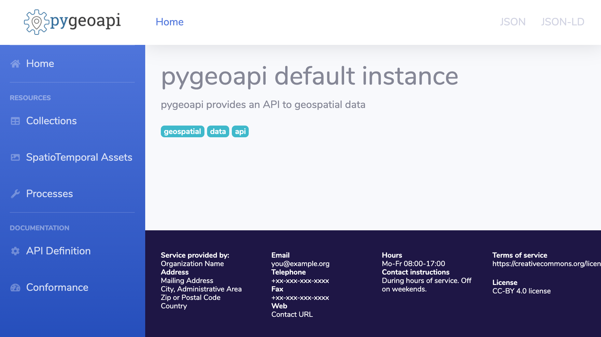

# pygeoapi-skin-dashboard
A skin for [pygeoapi](http://pygeoapi.io), based on a typical dashboard interface



Skin is inspired by [StartBootstrap Dashboard](https://startbootstrap.com/theme/sb-admin-2).

# Installation

Clone this repository in a folder.
Open pygeoapi config file and uncomment templates section.
Point paths to relevant folders

```YML
    templates:
      path: /tmp/skin-dashboard/templates
      static: /tmp/skin-dashboard/static
```

(Re)start service
